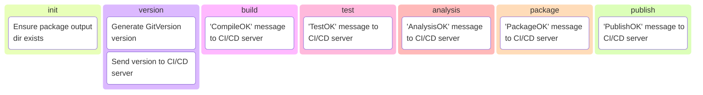

# ZeroFailed.Build.Common

A [ZeroFailed](https://github.com/zerofailed/ZeroFailed) extension containing general purpose features that support build processes across a variety of technology stacks and toolchains.

## Features Overview

| Component Type | Included | Notes                                                                                                                                    |
| -------------- | -------- | ---------------------------------------------------------------------------------------------------------------------------------------- |
| Functions      | no       |                                                                                                                                          |
| Tasks          | yes      |                                                                                                                                          |
| Processes      | yes      | Includes a generic logical build process designed to be integrated with by other extensions that provide the actual build functionality. |

For more information about the different component types, please refer to the [ZeroFailed documentation](https://github.com/zerofailed/ZeroFailed/blob/main/README.md#extensions).

This extension consists of the following feature groups, refer to the [HELP page](./HELP.md) for more details.

- General Build
- CI/CD Server integration
- Versioning

## Processes

### build.process.ps1

This is a generic process designed to support build-related scenarios and is typically referenced by other other domain-specific ZeroFailed.Build.* extensions.

To use this process ensure that your reference to this extension includes the `Process` property as below:

```
$zeroFailedExtensions = @(
    @{
        Name = "ZeroFailed.DevOps.Common"
        Process = "tasks/build.process.ps1"
    }
)
```

***NOTE**: If using another `ZeroFailed.Build.*` extension, then typically these reference this process as part of their dependencies, in which case the above will be unnecessary.*

This models an opinionated abstract build process that is intended to be generic enough to support a variety of different technology stacks and toolchains, as can be seen in the diagram below.


Each of the above stages has `Pre` & `Post` tasks which are intended as extensibility points that can be used to customise the process as required. (e.g. `PreBuild`, `PostBuild`, `PrePackage` etc.)

For convenience, it also provides `RunFirst` & `RunLast` tasks that can be used when necessary.

Typically, these extensibility tasks will be referenced at the end of the script that runs your automated process. For example, below we see a custom task called `MyCustomPackagingTask` that is set as a dependency of the `PrePackage` task provided by this extension; this has the effect of running the custom task before other packaging-related tasks.

```
task PrePackage MyCustomPackagingTask

task MyCustomPackagingTask {
    # Do something special
}
```

The diagram below shows the features provided by this extension and when they run as part of the above build process.

